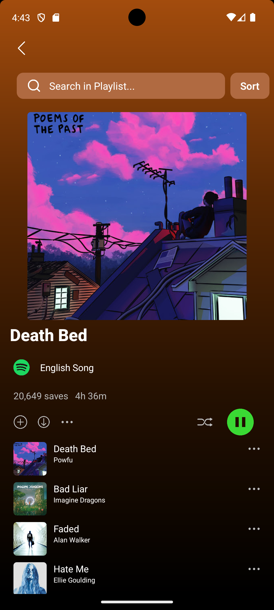

# MySpotify- React Native

Welcome to the Spotify Clone App built with React Native! Dive into the world of music on your mobile device. Browse and listen to your favorite tracks seamlessly with a user-friendly interface.

## Table of Contents

- [Introduction](#introduction)
- [Features](#features)
- [Installation](#installation)
- [Usage](#usage)
- [Technologies Used](#technologies-used)
- [Contributing](#contributing)

## Introduction

The Spotify Clone App is a React Native application designed to provide users with an immersive music streaming experience. With features like playlist management, audio playback controls, and personalized recommendations, users can enjoy their favorite tunes on the go.

            

## Features

- **Responsive Design:** Enjoy a seamless and responsive user interface across various devices.

- **Offline Playback:** Download your favorite songs and playlists for offline listening.
- **Audio Playback Controls:** Control playback with features like play, pause, skip, and shuffle.

- **Music Streaming:** Explore an extensive catalog of songs, albums, and playlists from various artists.
- **Personalized Playlists:** Enjoy curated playlists tailored to your musical taste.

## Installation

1. Clone the repository.
   ```bash
   git clone https://github.com/Anshu470456/MySpotify.git
   ```
2. Install dependencies using your preferred package manager.
   ```bash
   npm install
   ```
3. Run the app:

   ```bash
   npm start

   ```

## Usage

1. Run the app: npm start
2. Open the app on your device using the Expo Go app or an emulator.

## Technologies Used

- React Native CLI
- **Dependencies Used :-**

  - @react-native-community/slider: ^4.5.0
  - react: 18.2.0
  - react-native: 0.73.5
  - react-native-linear-gradient: ^2.8.3
  - react-native-modal: ^13.0.1
  - react-native-track-player: ^4.0.1

## Contributing

Contributions are welcome! Feel free to open an issue or submit a pull request.
